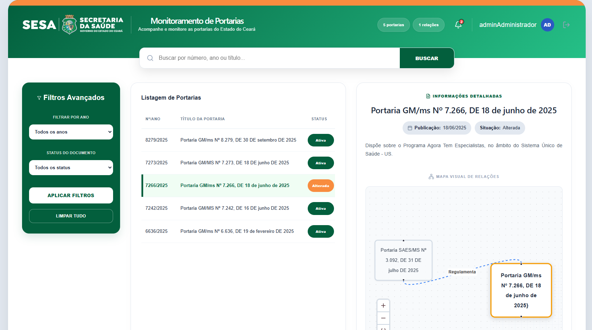

# 📑 Monitora Portarias

Sistema web desenvolvido para monitoramento, pesquisa e visualização de relações jurídicas entre portarias da Secretaria da Saúde.

O projeto permite visualizar alterações, vínculos e histórico jurídico de portarias através de uma interface moderna, intuitiva e organizada em timeline.

---

# 🚀 Tecnologias Utilizadas

## Frontend
- React
- TypeScript
- Vite
- CSS3

## Backend
- FastAPI
- Python
- SQLAlchemy

## Banco de Dados
- SQLite (desenvolvimento)
- PostgreSQL (futuramente)

---

# ✨ Funcionalidades

✅ Pesquisa de portarias  
✅ Filtros avançados  
✅ Visualização de relações jurídicas  
✅ Timeline de alterações  
✅ Interface moderna e responsiva  
✅ Dashboard analítico  
✅ Integração Frontend + Backend  
✅ API REST com FastAPI  

---

# 🖥️ Preview do Sistema

## Tela Principal




> Substitua futuramente pela imagem real do sistema.

---

# 📂 Estrutura do Projeto

```bash
MonitoraPortarias/
│
├── backend/
│   ├── app/
│   ├── requirements.txt
│   └── main.py
│
├── frontend/
│   ├── src/
│   ├── public/
│   ├── package.json
│   └── vite.config.ts
│
├── .gitignore
├── README.md
└── docker-compose.yml
```

---

# ⚙️ Como Executar o Projeto

## 🔹 Backend

### 1. Acesse a pasta backend

```bash
cd backend
```

### 2. Crie o ambiente virtual

```bash
python -m venv venv
```

### 3. Ative o ambiente virtual

#### Windows

```bash
venv\Scripts\activate
```

#### Linux/Mac

```bash
source venv/bin/activate
```

### 4. Instale as dependências

```bash
pip install -r requirements.txt
```

### 5. Execute o servidor

```bash
uvicorn app.main:app --reload
```

---

## 🔹 Frontend

### 1. Acesse a pasta frontend

```bash
cd frontend
```

### 2. Instale as dependências

```bash
npm install
```

### 3. Execute o projeto

```bash
npm run dev
```

---

# 🌐 Endpoints da API

## Exemplos

```http
GET /portarias
```

```http
GET /portarias/{id}
```

```http
GET /relacoes
```

---

# 🎯 Objetivo do Projeto

O objetivo do sistema é facilitar o acompanhamento e análise de portarias, permitindo uma visualização clara das relações jurídicas, alterações e impactos administrativos ao longo do tempo.

---

# 📈 Melhorias Futuras

- Autenticação de usuários
- Dashboard com gráficos
- Integração com PostgreSQL
- Exportação de relatórios
- Sistema de notificações
- Deploy em nuvem
- Dockerização completa

---

# 👨‍💻 Autor

Desenvolvido por **Anderson Alves Silva**.

- GitHub: https://github.com/andersonalvessilva

---

# 📄 Licença

Este projeto é destinado para fins de estudo, desenvolvimento e demonstração de portfólio.
